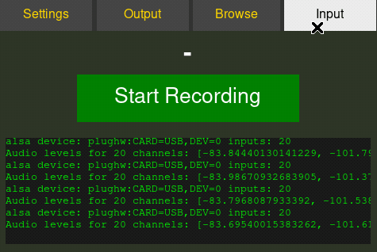

#  Recberry
**Recberry** is a standalone multi-channel audio recording and playback system based on Raspberry Pi. Designed to be reliable and easy to use on the go, it features a graphical interface optimized for 3.5" touchscreens (480x320) and intelligent storage management.




## 🚀 Project Purpose
The goal of Recberry is to transform a Raspberry Pi into an advanced standalone audio recorder via USB interface. It is specifically designed for reliable multi-track recording and field monitoring, rather than being a general-purpose digital audio workstation (DAW).

## 💡 Use Cases
- **Band Rehearsals & Live Concerts**: Record from a USB mixer without a computer. Supports multi-track recording (if supported by hardware) and saves to SD, USB sticks, or external HDDs. Its small footprint makes it ideal for live environments.
- **Conferences & Lectures**: Connect a USB microphone directly to Recberry (can be battery-powered) to record without using phone storage. Listen back later via headphones connected to the USB or Pi audio output.
- **Collaborative Growth**: We are constantly adding new features and evolving the list of use cases together!

## ⚠️ Hardware Disclaimer
This system has been exclusively tested with **3.5" SPI LCD displays** (like the WaveShare tft35a overlay) with a native resolution of **480x320**. While it might work on other displays, the UI layout is strictly optimized for these specific screen dimensions and aspect ratio.

## 🎨 Contributions & Graphical Optimizations
Graphic and UI optimizations are highly welcome! If you have ideas for improving the layout, adding animations, or modernizing the interface while keeping it touch-friendly, feel free to contribute.
- **Multi-channel Recording**: Supports audio interfaces with multiple inputs, recording each channel into a separate lossless FLAC file.
- **Playback Engine**: Synchronized multi-track playback of recorded sessions directly from disk.
- **Digital Mixer**: Real-time Volume (-inf to +6dB) and Pan (L/C/R) control for each track with persistent settings per session.
- **Output Routing**: Advanced selection of output audio devices and stereo channel mapping (L/R) with global persistence.
- **Touch Interface**: GUI developed in Tkinter, optimized for 480x320 resolution with ultra-large touch targets and scrollable logs.
- **Failsafe Storage**: Priority saving to USB with automatic fallback to internal SD. Intelligent handling of paths and disk mounting.
- **Audio Monitoring**: Visual feedback of peak levels for each input channel.
- **System Management**: Sample rate selection (44.1kHz / 48kHz), WiFi management, and system reboot/shutdown directly from the interface.

## 🛠 Required Hardware
1. **Raspberry Pi**: (Pi 4 or Pi 3B+ recommended for multi-track playback performance).
2. **USB Audio Interface**: Any ALSA-compatible interface.
3. **Touchscreen**: 3.5" display (480x320) connected via GPIO or HDMI.
4. **External Storage**: USB flash drive/SSD for recordings.

## 📥 Installation
Ensure you have `ffmpeg`, `alsa-utils`, and the necessary Python libraries installed:

```bash
sudo apt update
sudo apt install ffmpeg alsa-utils python3-tk python3-numpy python3-pyaudio python3-soundfile
```

Clone the repository and start the interface:
```bash
git clone https://github.com/your-username/recberry.git
cd recberry
python3 gui.py
```

## 📂 Project Structure
- `recorder.py`: Core recording engine. Manages `ffmpeg` processes and storage logic.
- `player.py`: Core playback engine. Handles multi-track synchronization and output routing.
- `gui.py`: Optimized touch-friendly interface.
- `bg.png`/`logo.png`: Graphical assets.

## ⚙️ Technical Details
The system utilizes **FFmpeg** for high-quality audio capture and **PyAudio** with **Numpy** for low-latency multi-track mixing during playback. Settings are persisted in JSON format (`output_settings.json` for global routing, `mixer.json` for session-specific mixes).

---
## 📄 License
This project is licensed under the **MIT License**. See the [LICENSE](LICENSE) file for details. This means you are free to use, modify, and distribute the code, even for commercial purposes, as long as you include the original copyright notice.

## ☕ Support & Donations
If you find Recberry useful and would like to support its development, you can:
- **Donate**: [Buy Me a Coffee](https://buymeacoffee.com/banorz) / [PayPal](https://paypal.me/ValerioLibera)
- **Contribute**: Feel free to open issues or submit pull requests!

## 🛠️ Get a Ready-to-Use Unit
Don't want to deal with assembly and configuration? I offer **pre-assembled, tested, and ready-to-use Recberry units**.
- Includes: Raspberry Pi, configured OS, 3.5" touchscreen, and optional cases.
- Hand-assembled and quality-tested.
- For info and pricing: [Contact me](mailto:contact@valeriolibera.it)

Developed with ❤️ for Raspberry Pi.
